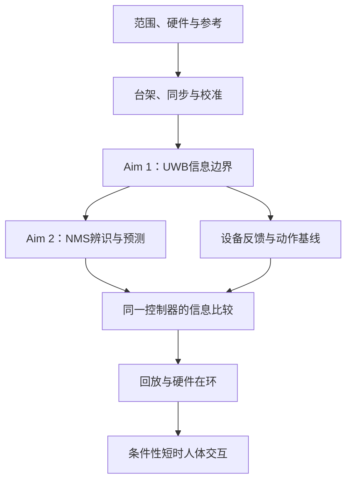

# 博士研究任务分解：30个工作包

**编制日期：2026-10-05（Asia/Tokyo）。**主计划：[完整中文计划](PHD_PROPOSAL_ZH.md)。执行入口：[前90天计划](FIRST_90_DAYS_PLAN_ZH.md)。

本分解保持 **人体神经肌骨系统 + 具身智能 + sensing/modeling/control/interaction** 的组织逻辑。UWB 是主要动作观测工具；IMU 为可选组。文献边界沿用截至2026-10-04的 [gap/nearest-work索引](GAP_VALIDATION_AND_NEAREST_WORK.md)，编制本执行文档不意味着重新完成了一轮文献检索。

**所有研究工作包当前均为待执行。**本次完成的是任务分解，尚未完成硬件测量、参与者采集、基线复现或实验验证。后文所列产物是预期交付，不表示已有实验结果。

## 如何使用

每个工作包写明输入、具体步骤、独立证据、完成判据、最近邻和失败后的路径。“任务完成”与“研究假设成立”分开：可靠测到负结果也可完成任务；只有对应条件满足，才能推进更强实验或主张。

- **P0：阶段前提。**当前阶段缺少它，就不能做依赖它的研究。
- **P1：核心研究。**用于完成三个Aim及博士整合。
- 患者访问、额外IMU、复杂生成模型、新RL算法、额外成像和第二套机器人均为条件性扩展，不能反过来成为全部核心工作的依赖。

窗口从确认研究/入学开始计，相互重叠；不是把所有时间相加。研究者负责主要执行，设备、神经机械、控制或临床环节需要相应协作者支持；这里不代表这些人员/资源已落实。

| 阶段 | 工作包数量 | 所回答的问题 |
|---|---:|---|
| 基础 | 6 | 范围、接口、时间/坐标和独立参考 |
| Aim 1 | 8 | UWB任务状态与失效边界 |
| Aim 2 | 7 | 独立净力矩预测及更新价值 |
| Aim 3 | 6 | 同控制器下人体信息的动作增量 |
| 整合 | 3 | 统计冻结、复现/主张与博士论文 |

## 关键依赖

空间状态可用，不自动意味着力学/生理状态可信。Aim2若不支持NMS复杂度，控制比较应减少复杂组并保留这一负结果；可继续检验更简单动作信息的价值。

## 基础工作包

### F01｜固定问题、子系统与端点

**窗口/优先级：**第1–2月；P0。**前置：**无；从已有计划开始。

**输入：**现有中文计划；拟用设备/任务范围。

**具体步骤：**确定肘角与手到目标位置；划分感知全身轨迹和坐位上肢力学轨迹；定义更新项、部署输入和实验参考。

**交付与完成判据：**端点与范围表 v0。每个端点有单位、独立参考、主/次地位、可支持的结论及不可支持的结论；IMU 可选组明确。

**最近邻/必需对照：**[R01]、[R18]；与已有角度测量/柔顺控制区分。

**若未满足推进条件：**若外力无法完整测量，力学先缩减为可独立参考的肘主导任务。

### F02｜建立 nearest-work 与主张对照

**窗口/优先级：**第1月起，投稿前更新；P1。**前置：**F01。

**输入：**已有 gap/文献索引。

**具体步骤：**逐项对应 H1–H3；记录最近方法输入、校准、数据、端点、版本和可复现性；给出可以推翻残余 gap 的证据。

**交付与完成判据：**主张—最近邻—增量—反证矩阵。每项预期贡献至少有最近工作和强简单对照；状态仍按部分解决/待实验验证表述。

**最近邻/必需对照：**[R01]、[R04]、[R07]、[R12]、[R13]、[R18]、[R21]。

**若未满足推进条件：**若残余已被解决，转为复现、外部验证或一个不同的可检验限制。

### F03｜完成 UWB 与辅助设备能力清单

**窗口/优先级：**第1–2月；P0。**前置：**F01。

**输入：**真实标签、锚点、固件/API、实验室设备清单。

**具体步骤：**实录 TDoA/TWR/位置输出、链路时间、有效更新率、质量字段、标签间接口、同步方式和访问权限；核查 EMG/光学/测力/机器人接口。

**交付与完成判据：**硬件能力表和一段未加工样例记录。确认可用观测模式、单位和时间源；有效更新率由实录计算；缺失能力明确列出。

**最近邻/必需对照：**[R02]、[R09]、[R10]；不用传输率替代定位率。

**若未满足推进条件：**仅位置输出时采用位置误差模型；缺少硬件则先公开数据/台架准备，不声称已验证部署。

### F04｜统一坐标、时间和数据身份

**窗口/优先级：**第1–3月；P0。**前置：**F03。

**输入：**各设备样例、安装图和坐标约定。

**具体步骤：**定义世界/设备/解剖坐标；保留原始时间和时钟域；记录校准与参与者/会话/任务身份；标记插值、离线处理和数据角色。

**交付与完成判据：**数据字典、同步/坐标说明及清单模板。一条输出可回溯到原始包、变换与校准版本；单位一致；未来数据不进入因果估计。

**最近邻/必需对照：**[R02]、[R04]；原始输入与派生量分开。

**若未满足推进条件：**不能硬同步时测量软件同步偏差/漂移，超出预算的数据不用于相关端点。

### F05｜核实独立参考与误差预算

**窗口/优先级：**第1–4月，按端点分批；P0。**前置：**F01、F03、F04。

**输入：**编码器/几何测量、光学、测力/测力计及可用外力。

**具体步骤：**量化参考重复性、坐标/时间误差；列出已测和未测接触；为角度、手位、延迟及净力矩建立任务预算。

**交付与完成判据：**参考有效性报告与预算表 v0。每个参考可独立于待评模型计算；任务容差的依据明确；未测支撑力时不宣称动态净力矩参考有效。

**最近邻/必需对照：**[R11]、[R12]、[R21]；模型输出不充当自身真值。

**若未满足推进条件：**动态参考不成立时采用已知负载/等长端点；缩减力学范围。

### F06｜完成先导协议与资源安排

**窗口/优先级：**第1–6月；P0。**前置：**F01、F03、F05。

**输入：**任务范围、设备能力、参考和研究访问条件。

**具体步骤：**确定健康先导的会话/重新佩戴/负载结构；形成参与者流程与数据同意方案；记录预计脱落、工时与实际可用资源。

**交付与完成判据：**可实施先导协议、招募/访问条件与日程草案。拟6–8名健康参与者、2–3次访问仅为规划；实际人体采集遵循已获得的研究条件；临床和机器人访问不默认成立。

**最近邻/必需对照：**本计划实验设计清单；方法边界见 [R18]、[R21]。

**若未满足推进条件：**条件未齐时做台架、公开数据和协议准备；完整先导可延续到第3–6月。

## Aim 1工作包

### A1-01｜搭建编码器关节台架

**窗口/优先级：**第1–4月；P0。**前置：**F03、F04、F05。

**输入：**可测角度的关节/夹具、测量模式及参考几何。

**具体步骤：**建立重复角度/轨迹；更换合理布局与附着位置；保留标签/锚点图和原始时间。

**交付与完成判据：**台架数据及几何/轨迹清单。能重复产生同类状态与布局变化；编码器参考独立；每种记录有可追踪校准。

**最近邻/必需对照：**[R01]、[R06]；角度测量与几何推断为已有基础。

**若未满足推进条件：**多关节台架不可得时先单铰链；不从单铰链结果外推全身。

### A1-02｜表征实际无线误差

**窗口/优先级：**第2–5月；P0。**前置：**A1-01。

**输入：**台架原始距离差/距离/位置和参考。

**具体步骤：**分别统计静态/动态、可见/遮挡、附着/布局变化；估计偏差、尾部、相关性、掉线和有效更新时序。

**交付与完成判据：**条件化误差报告与观测噪声模型。模型与硬件输出一致；共享锚点/时序相关性不被忽略；报告失败记录而非仅成功帧。

**最近邻/必需对照：**[R02]、[R04]、[R09]；经典定位/误差包装。

**若未满足推进条件：**复杂分解无法辨识时用可校准的经验输出分布，并限定解释。

### A1-03｜分析任务可观测性与布局

**窗口/优先级：**第2–6月；P1。**前置：**A1-01、A1-02。

**输入：**人体/台架几何、测量 Jacobian 和实测误差。

**具体步骤：**移除坐标规范自由度后分析秩与敏感性；构造可重复歧义；以相同测距资源比较布局；区分测量约束和先验约束。

**交付与完成判据：**状态—布局—歧义图及候选配置。理论歧义有台架/参考支持；给出可用状态及需额外信息的状态；不将局部满秩等同全局唯一或临床准确。

**最近邻/必需对照：**[R01]、[R06]、[R07]；固定布局为对照。

**若未满足推进条件：**轴向转动等无法可靠恢复时删除该自由度，或量化可选补充观测。

### A1-04｜建立人体解剖校准与同步流程

**窗口/优先级：**第3–6月；P0。**前置：**F04、F05、A1-03。

**输入：**UWB/光学同步片段、节段定义和佩戴位置。

**具体步骤：**固定标签到节段与锚点到设备变换；测量重新佩戴重复性；检查时钟漂移和因果运行延迟。

**交付与完成判据：**校准流程、同步报告和每会话版本记录。可重复执行；时间/坐标误差有实测范围；校准与评价片段有角色分离。

**最近邻/必需对照：**[R04]、[R20]；经典校准与可选融合。

**若未满足推进条件：**校准误差超预算时修改布局/任务；不能靠事后对齐隐藏物理坐标误差。

### A1-05｜复现可比感知基线

**窗口/优先级：**第2–8月；P1。**前置：**F02、F04、A1-02、A1-03。

**输入：**实测/公开数据、兼容输入与候选布局。

**具体步骤：**先定位+约束IK，再UWB-only回归；选择可复现的WiP/融合方法；记录原代码/适配版本及在线延迟、佩戴与计算预算。

**交付与完成判据：**输入兼容性表和统一基线评估入口。至少一个经典与一个兼容强基线；IMU输入单列；由位置派生距离的适配不能冒充原始测距复现。

**最近邻/必需对照：**[R03]、[R04]、[R06]、[R07]、[R20]。

**若未满足推进条件：**软件/输入不可用时说明限制，使用可复现强对照；不以弱重实现证明优势。

### A1-06｜采集重复会话与变化条件

**窗口/优先级：**第3–12月；P1。**前置：**F06、A1-04。

**输入：**已可实施协议、UWB/光学和稳定校准。

**具体步骤：**先健康先导；分开记录重新佩戴、布局/房间和动作变化；以坐位到达为主端点并保留全身功能评估轨迹。

**交付与完成判据：**先导/主研究清单、质量报告和缺失原因。每人会话顺序与每次佩戴可追踪；变化因素能区分；主测试人员/片段不参与开发；患者轨迹条件性开展。

**最近邻/必需对照：**[R03]、[R05]、[R07]；现有运动数据不作患者NMS真值。

**若未满足推进条件：**时间/临床资源不足时保留健康跨会话边界；不以模拟损伤替代患者结论。

### A1-07｜校准任务不确定性与拒绝规则

**窗口/优先级：**第5–10月；P1。**前置：**A1-03、A1-05、A1-06。

**输入：**开发集、参考误差和候选状态分布。

**具体步骤：**比较点输入、相关后验与普通校准包装；计算CRPS、覆盖/宽度及误差—可用比例权衡；开发集选择配置与阈值。

**交付与完成判据：**锁定候选模型与校准规则。不能通过宽区间或持续拒绝获得表面成功；同时报告准确性、覆盖、时延和数据可用性。

**最近邻/必需对照：**[R04]；校准包装与几何基线。

**若未满足推进条件：**复杂概率模型无增益时保留简单校准；描述在哪些条件下失败。

### A1-08｜完成独立感知验证与论文1

**窗口/优先级：**第9–12月；P1。**前置：**A1-06、A1-07、X01。

**输入：**冻结方案和未用于调参的人员/会话/条件。

**具体步骤：**一次执行预定主对比；按参与者汇总肘角CRPS和伴随指标；报告误差边界、配置负担与负结果。

**交付与完成判据：**Aim1结果包、论文草稿与复现记录。最近邻、输入和预算透明；结论限定任务/条件；失败不通过重新调参改写为独立成功。

**最近邻/必需对照：**[R01]、[R04]、[R06]、[R07]、[R20]。

**若未满足推进条件：**不可观测性是可报告结果；后续仅使用已验证可用状态。

## Aim 2工作包

### A2-01｜确定简化NMS结构与候选参数

**窗口/优先级：**第8–12月；P0。**前置：**F01、F05、A1-03、A1-04。

**输入：**可观测状态、目标EMG/外力能力和已有模型。

**具体步骤：**选择肘主导/平面肩肘模型；检查上肢实现；固定大部分参数；列出神经、激活、几何、力学与模型差异的角色。

**交付与完成判据：**模型结构及参数/干扰项清单。每个拟合参数有数据约束和敏感性计划；软件存在不等于已验证上肢实现。

**最近邻/必需对照：**[R11]、[R12]、[R14]、[R21]；通用缩放模型。

**若未满足推进条件：**不可辨识或实现过重时采用简化EMG-informed净力矩模型。

### A2-02｜建立EMG—外力—运动参考

**窗口/优先级：**第10–14月；P0。**前置：**F04、F05、F06、A2-01。

**输入：**同步EMG/光学/UWB、已测外力与接触清单。

**具体步骤：**明确EMG拟合/参考通道；测量力坐标与零点；检查惯性、导数处理、支撑力和参考重复性。

**交付与完成判据：**独立净力矩参考流程与不确定性说明。参考不使用待评UWB估计；未测接触明确；同一EMG通道不同时声称独立验证。

**最近邻/必需对照：**[R11]、[R12]、[R21]；等长/已知负载参考。

**若未满足推进条件：**动态净力矩参考无效时减少任务或改等长端点，不评价未验证内部肌肉力。

### A2-03｜辨识个体参数与等价关系

**窗口/优先级：**第11–16月；P1。**前置：**A2-01、A2-02。

**输入：**开发校准任务、EMG、参考力矩及参数先验。

**具体步骤：**敏感性与多初值/先验分析；检查参数补偿；对比通用缩放和单次个体化；冻结缺乏约束的参数。

**交付与完成判据：**实际可辨识性报告及精简个体模型。拟合好不等于参数唯一；列出可辨识参数、干扰项与等价类。

**最近邻/必需对照：**[R14]、[R21]；通用/单次个体化对照。

**若未满足推进条件：**无法分辨时报告预测等价模型，限制生理解释。

### A2-04｜传播空间与参数不确定性

**窗口/优先级：**第12–18月；P1。**前置：**A1-07、A2-02、A2-03。

**输入：**联合状态后验、校准误差、精简NMS模型。

**具体步骤：**保留共享锚点/时间相关性采样；比较均值输入、联合样本、概率黑箱和普通校准；进行受控误差与模型差异敏感性分析。

**交付与完成判据：**误差传播/消融结果与运行负担。各方法EMG/外力/校准预算相同；不因软件分量命名而宣称其物理分解可辨识。

**最近邻/必需对照：**[R04]、[R13]；点输入/校准包装。

**若未满足推进条件：**后验传播无实用效应时采用更简单不确定性输出并报告零增益范围。

### A2-05｜区分会话校准与人体更新

**窗口/优先级：**第14–20月；P1。**前置：**A2-03、A2-04。

**输入：**重复EMG/外力会话与固定参考任务。

**具体步骤：**对比冻结、仅附着/EMG尺度更新、小规模人体参数更新；留出更新与评价片段；检验变化是否随佩戴/电极改变。

**交付与完成判据：**会话更新规则与混淆审查。没有独立证据时不把尺度/标签变化解释为疲劳或恢复；更新时间与数据角色可追踪。

**最近邻/必需对照：**[R12]、[R14]；校准-only 为强对照。

**若未满足推进条件：**仅更新干扰项；若不必要则保留冻结模型。

### A2-06｜锁定未见负载/会话预测

**窗口/优先级：**第18–24月；P1。**前置：**A2-04、A2-05、X01。

**输入：**冻结模型/校准规则和未用于调参的条件。

**具体步骤：**预留一个负载水平与后续会话；在相同可用运动/EMG/外力信息下评价净力矩分布；动作前响应预测另在Aim3记录。

**交付与完成判据：**独立净力矩预测和条件迁移结果。主端点CRPS及覆盖/偏差有参与者级区间；不把事后输入条件预测当作动作前预测。

**最近邻/必需对照：**[R13]、[R14]、[R17]；概率黑箱/光学输入。

**若未满足推进条件：**无增益或校准主导时报告适用边界，不再宣称更强人体解释。

### A2-07｜形成论文2与控制可用接口

**窗口/优先级：**第22–25月；P1。**前置：**A2-06。

**输入：**辨识、传播、锁定预测和失败结果。

**具体步骤：**审查每个神经/肌肉/力矩主张；定义模型状态、分布、更新时间、缺失与有效性标签；撰写增量和负结果。

**交付与完成判据：**Aim2论文、状态接口与模型版本。控制只接收已验证端点；内部肌肉力标为模型依赖；接口定义与预测证据一致。

**最近邻/必需对照：**[R11]、[R12]、[R13]、[R14]、[R21]。

**若未满足推进条件：**模型不合格时接口退回运动/力矩估计，保留NMS复杂度无效的证据。

## Aim 3工作包

### A3-01｜建立设备反馈与基础控制器

**窗口/优先级：**第20–24月；P0。**前置：**F03、F05、A1-04。

**输入：**可访问机器人/台架、编码器与外力反馈。

**具体步骤：**确认坐标、周期、限幅和模式转换；复现可用导纳/按需辅助；量化仅设备反馈能完成的任务。

**交付与完成判据：**保守控制基线及接口报告。低层设备行为可独立于人体模型核查；若设备反馈已充分，仍保留此强基线。

**最近邻/必需对照：**[R18]；编码器/力反馈控制。

**若未满足推进条件：**设备不可用时转回放/HIL；不承诺已完成物理人体交互。

### A3-02｜固定信息组与公平预算

**窗口/优先级：**第22–26月；P1。**前置：**A2-07、A3-01。

**输入：**同一控制器、已验证状态接口。

**具体步骤：**设置设备反馈、动作-only、点NMS、后验NMS、确定性回退与校准包装；统一控制限幅和比较预算。

**交付与完成判据：**控制组配置与冻结对比表。区分人体信息和控制律变化；输入、校准时间、延迟与佩戴负担透明。

**最近邻/必需对照：**[R08]、[R13]、[R18]。

**若未满足推进条件：**Aim2不足时保留简单组，不强行开展未经验证NMS的人体辅助。

### A3-03｜定义独立动作约束与响应标签

**窗口/优先级：**第22–27月；P0。**前置：**F05、A3-01。

**输入：**设备约束、独立参考及模型/测量有效性范围。

**具体步骤：**定义决策机会、力/速度/工作空间边界；记录动作前预测与动作后响应；区分影子违规、实测违规和未知标签。

**交付与完成判据：**风险/响应标签规范与参考评估器。NLOS/OOD不是危险真值；风险和漏检分母明确；无法独立标定的机会标为未知并计入缺失。

**最近邻/必需对照：**[R13]、[R18]；独立参考决策和普通故障规则。

**若未满足推进条件：**参考不足时只评价明确可核查的约束，不宣称组织安全。

### A3-04｜完成回放与故障对比

**窗口/优先级：**第23–28月；P1。**前置：**A3-02、A3-03。

**输入：**冻结控制组、记录数据及独立标签。

**具体步骤：**回放掉线、延迟、附着偏差与有依据的错误；比较继续/减弱/回退和任务代价；固定开发与测试故障片段。

**交付与完成判据：**风险—任务表现—干预负担结果。同延迟/资源下比较；持续拒绝不算成功；故障注入结论限定回放，反事实力响应注明模型假设。

**最近邻/必需对照：**[R04]、[R13]、[R18]；确定性/校准回退。

**若未满足推进条件：**后验组无增益时保留负结果，并减少后续人体复杂组。

### A3-05｜完成HIL与人体交互推进核查

**窗口/优先级：**第25–29月；P0。**前置：**A3-04。

**输入：**可独立核查的台架/设备反馈及冻结模式。

**具体步骤：**在无人承受辅助的条件核查时延、模式转换、约束与失效；记录验证覆盖及未通过项；形成有边界的推进决定。

**交付与完成判据：**HIL验证包与推进/修改/停止记录。任务/设备预算已定且被实测满足；检查范围可复现；无依据门槛不能作为通过。

**最近邻/必需对照：**[R12]、[R18]；现有设备控制与回退。

**若未满足推进条件：**未满足时保持离线/建议/影子决策，不把HIL当患者疗效。

### A3-06｜执行短时交互与论文3

**窗口/优先级：**第27–32月，条件性；P1。**前置：**A3-05、F06、X01。

**输入：**研究访问条件、冻结控制、通过的HIL及统计方案。

**具体步骤：**有界辅助顺序随机/平衡；记录实际响应和任务表现；联合风险比较与非劣检验；检查顺序/适应残留。

**交付与完成判据：**短时交互结果、论文3或可靠负/可行性结果。健康/患者分开；计划人数须正式设计支持；少数/零违规不证明临床安全；短期结果不证明恢复。

**最近邻/必需对照：**[R12]、[R13]、[R18]；相同控制器和设备反馈。

**若未满足推进条件：**人机/临床访问不足时完成HIL层次论文，并明确证据层级。

## 整合工作包

### X01｜冻结统计、划分与成功规则

**窗口/优先级：**第4–6月起，每个主测试前；P0。**前置：**F06。

**输入：**相应Aim先导数据、资源和参考重复性。

**具体步骤：**参与者/时间分组；估计方差/相关/脱落；仿真样本量；冻结容差、主基线和主对比；定义Aim3联合检验及跨Aim多重比较。

**交付与完成判据：**版本化统计方案、划分清单与设计假设。先导不冒充独立确认性测试；阈值/校准不使用主测试；每个样本数字有精度/功效依据或注明可行性。

**最近邻/必需对照：**主计划的CRPS、风险/非劣、混合效应、聚类区间和Holm方案。

**若未满足推进条件：**招募不足时降低推断层级，保留效果/精度区间。

### X02｜审查复现、数据角色与主张

**窗口/优先级：**各Aim主测试与投稿前；P1。**前置：**F02、F04。

**输入：**每个Aim的模型/数据/结果版本。

**具体步骤：**核查泄漏、源数据重叠、基线兼容性、失败记录和版本；更新nearest-work；确定可公开数据与可执行适配范围。

**交付与完成判据：**每Aim复现/主张审查清单。论文增量有最近邻和独立端点；结果区分原代码、适配、离线、在线、仿真和物理。

**最近邻/必需对照：**[R03]、[R04]、[R05]、[R06]、[R07]、[R12]。

**若未满足推进条件：**无法支持的主张删除或改为条件性/工程/外部验证。

### X03｜整合博士论文与证据边界

**窗口/优先级：**第32–36月；P1。**前置：**A1-08、A2-07、A3-06、X02。

**输入：**三Aim结果与条件性替代结果。

**具体步骤：**串联测量—模型—动作；整合正/负结果、资源权衡和个体绑定/更新来源；核查数字孪生与具身主张层次。

**交付与完成判据：**博士论文、复现材料及带边界的人体模型/系统。每一主张与实验证据对应；如人体阶段未开展，按已完成层次改写；不承诺三篇录用是既定毕业条件。

**最近邻/必需对照：**[R04]、[R12]、[R13]、[R18]；全部nearest-work索引。

**若未满足推进条件：**保留可靠负结果及可观测/辨识边界，按真实完成范围整合。

## 阶段推进条件

| Gate | 必需证据 | 未满足时 |
|---|---|---|
| G0：观测接口可用 | F03/F04给出真实观测模式、时间/单位/坐标和未加工样例。 | 采用实际位置接口或公开数据路径；删除不支持的原始无线/标签间论断。 |
| G1：任务空间状态可用 | 台架、校准、重复记录支持选定状态；角度/手位/时延预算及参考重复性已有数值依据。 | 调布局、缩减状态或量化补充观测；不直接进入相关NMS/控制论断。 |
| G2：独立力学端点有效 | EMG/外力同步、接触与参考有效；少量参数辨识或预测有效性已检查。 | 简化模型/改等长端点；内部力保持模型依赖。 |
| G3：可进入物理交互 | 同控制器信息比较、独立约束、HIL模式/时延/回退核查通过，且研究访问条件已齐。 | 保持回放/HIL/影子决策；按对应层次报告。 |
| G4：可提出增量贡献 | 冻结后的独立测试支持预定主比较；强基线/预算/区间透明，nearest-work更新。 | 报告负结果、外部验证或工程贡献；不通过重新包装宣称成功。 |

门槛的角度、手位、时延、净力矩、区间/可用比例及非劣数值，必须由任务要求与先导参考支持，在独立主测试前冻结。尚未有数据时不填入貌似精确的临床阈值；缺少数值依据也不能标为通过。

## 与三篇论文的对应

| 计划论文 | 主要工作包 | 应有增量 | 可以成立的负结果 |
|---|---|---|---|
| 论文1：任务可观测性与失效边界 | A1-01至A1-08，X01/X02 | 明确UWB测量真正约束的任务变量，并验证变化后的边界。 | 某些状态不可观测、最低补充信息或普通校准已经足够。 |
| 论文2：神经机械预测中的测量不确定性 | A2-01至A2-07，X01/X02 | 独立端点上超过校准-only/概率黑箱的预测证据，或其适用条件。 | 参数等价、误差传播无效、仅干扰项更新必要。 |
| 论文3：人体信息的物理动作价值 | A3-01至A3-06，X01/X02 | 同一控制器的风险/任务比较和真实响应证据；证据层级透明。 | 简单设备反馈足够，复杂人体信息无增益；仅HIL可行性。 |

投稿和录用不是本任务表已确认的毕业要求；实验结果决定论文的实际范围。

## 每周记录模板

每周只记录一个主要阻塞点和下一步最小可验证动作，避免大量并行开发。

| 字段 | 填写内容 |
|---|---|
| 当前工作包 / 状态 | ID；待开始、进行中、完成、修改路径或阻塞。 |
| 本周证据 | 原始记录/版本/图表/参考，不仅列完成的代码。 |
| 对应端点 / 基线 | 目标、独立参考和比较组。 |
| 最大不确定项 | 接口、时间/坐标、参考、辨识或动作标签中最重要的一项。 |
| 下周动作 | 能检验上述不确定项的最小实验/分析。 |
| 推进决定 | 对应Gate及通过、修改、停止的依据。 |
| 主张变化 | 最近邻或实测结果是否要求缩减结论。 |

## 前两周立即开始的事项

1. 执行F01/F03：确定一项上肢端点，拿到真实硬件能力表与未加工数据。
2. 执行F04/F05：列出所有时间源、坐标、独立参考与未测接触。
3. 执行F02：给H1–H3各写一行最近邻、增量和推翻条件。
4. 为A1-01准备最小编码器台架；人体采集先完成F06要求的研究条件。

完整90天顺序、实验矩阵、记录字段与日90交付见 [FIRST_90_DAYS_PLAN_ZH.md](FIRST_90_DAYS_PLAN_ZH.md)。

[R01]: https://pubmed.ncbi.nlm.nih.gov/24403428/
[R02]: https://pubmed.ncbi.nlm.nih.gov/38408007/
[R03]: https://siplab.org/projects/UltraInertialPoser
[R04]: https://arxiv.org/html/2505.09393v1
[R05]: https://siplab.org/projects/GroupInertialPoser
[R06]: https://siplab.org/projects/UltraDiffusionPoser
[R07]: https://arxiv.org/html/2601.19519v1
[R08]: https://tiers.utu.fi/publications/
[R09]: https://ieeexplore.ieee.org/document/11420874
[R10]: https://www.mdpi.com/1424-8220/26/18/5738
[R11]: https://pubmed.ncbi.nlm.nih.gov/39579665/
[R12]: https://research.utwente.nl/en/publications/ceinms-rt-an-open-source-framework-for-the-continuous-neuro-mecha-2/
[R13]: https://www.frontiersin.org/journals/neuroscience/articles/10.3389/fnins.2023.1254088/full
[R14]: https://link.springer.com/article/10.1186/s12984-025-01629-5
[R15]: https://proceedings.mlr.press/v168/caggiano22a.html
[R16]: https://www.nature.com/articles/s41586-024-07382-4
[R17]: https://link.springer.com/article/10.1186/s12984-026-02136-x
[R18]: https://www.sciencedirect.com/science/article/abs/pii/S092188901930898X
[R19]: https://www.sustech.edu.cn/en/faculties/zhangmingming.html
[R20]: https://pmc.ncbi.nlm.nih.gov/articles/PMC10422251/
[R21]: https://pubmed.ncbi.nlm.nih.gov/30056607/

