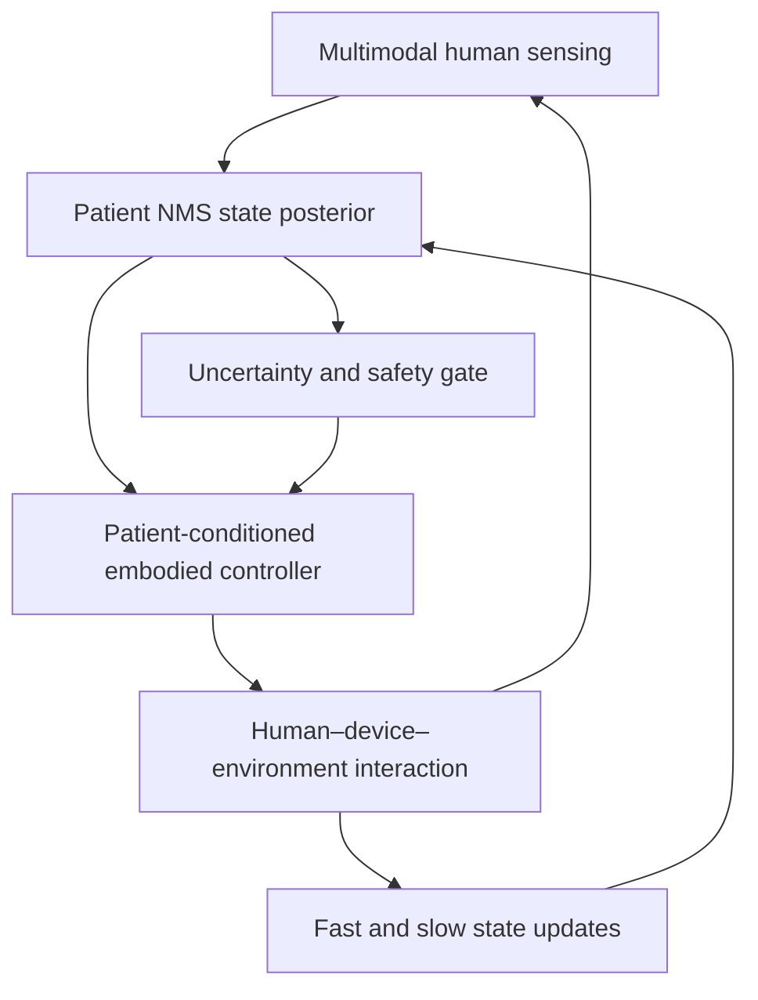

# PhD Research Proposal

## Title

**Patient-Grounded Neuromusculoskeletal Embodied Intelligence for Safe and Longitudinally Adaptive Human–Robot Assistance**

**Subtitle:** Identifiable State Representations, Uncertainty-to-Action Safety, and Two-Timescale Co-Adaptation

## Proposal status and scope

This proposal is derived from the preceding 60-paper literature map, 49 core-paper Embodied-AI critique and ten-candidate counter-evidence validation. Its scientific object is a closed loop:

The thesis is **not** an IMU gait-analysis project. IMU is an optional source of deployable kinematics, interchangeable with video, device encoders or other motion measurements when the research question permits. EMG and external-force information are more central when neural drive, voluntary contribution or internal load must be inferred.

The thesis is also **not described as a digital-twin project by default**. It uses a subject-specific digital representation only when that representation is identifiable, calibrated, predictive outside its fitting data and demonstrably changes an action or safety decision. If those gates fail, the correct terms are personalized estimator, patient-conditioned policy or adaptive controller.

The primary application is lower-limb post-stroke rehabilitation or wearable assistance because it exposes impairment heterogeneity, asymmetric neural drive, fatigue, compensation and repeated human–robot interaction. The methods are intended to generalize to upper-limb rehabilitation and prosthetic control, but those domains are external-validation opportunities rather than simultaneous thesis promises.

---

## 1. Background and motivation

Human neuromusculoskeletal (NMS) systems are active, adaptive and only partially observable. Similar joint trajectories can arise from different combinations of descending neural drive, co-contraction, weakness, abnormal synergy, fatigue, tendon mechanics and compensatory movement. A controller that observes only motion can therefore deliver apparently successful assistance while suppressing voluntary effort, reinforcing compensation or shifting load to an unsafe internal state.

Embodied intelligence is useful here because the research target is not a passive prediction model. It is an agent whose action changes the person and whose future observations depend on that interaction. A defensible human NMS embodied system must connect four elements:

1. **sensing:** measurements that constrain neural and mechanical state;
2. **modeling:** a human-grounded representation with explicit ambiguity and uncertainty;
3. **control:** actions chosen from the inferred state under performance and physiological constraints;
4. **interaction:** physical or hardware-in-the-loop evidence that the human and controller affect one another over time.

The field already contains strong examples of each element. The unresolved doctoral problem is how to connect them without treating simulator reward as physiology, kinematic personalization as patient-state identification, or an acute assistance result as rehabilitation recovery.

---

## 2. State of the art

### 2.1 Human NMS modeling and patient state estimation

OpenSim/CEINMS-family models link motion, external force, EMG-derived excitation, activation dynamics, muscle–tendon mechanics and joint loading. Real-time EMG-driven models and subject-specific calibration have enabled multi-degree-of-freedom state estimation and physical wearable-robot control. These methods establish that mechanistic NMS states can enter an interaction loop; they do not guarantee that fitted strength, synergy or muscle–tendon parameters are uniquely identifiable.

The nearest work includes real-time EMG-driven estimation by [Durandau, Farina and Sartori (2018)](https://doi.org/10.1109/TBME.2017.2704085), patient neuromechanical exoskeleton control by [Durandau et al. (2019)](https://doi.org/10.1186/s12984-019-0559-z), rapid RL-based personalization by [Berman et al. (2024)](https://doi.org/10.1109/TNSRE.2024.3483150), and real-time personalized tissue-state feedback by [Pizzolato et al. (2020)](https://doi.org/10.3389/fbioe.2020.00878). The residual problem is whether a small posterior over patient states is both identifiable and useful for unseen embodied decisions.

### 2.2 Muscle-driven Embodied AI

MyoSuite, MyoSim, MotorNet and recent whole-body muscle-control systems provide scalable environments for learning sensorimotor policies through muscle-actuated bodies. KINESIS, MUSIC and MuscleMimic directly weaken the broad claim that learned muscle policies have never been checked against human physiology. The remaining limitation is narrower: physiological agreement in generic or healthy simulation does not establish that a controller represents an impaired individual or will preserve patient-specific neural and mechanical behavior during device interaction.

MyoAssist 1.0 extends the field toward composed human–device–task simulation, while [Luo et al. (2024)](https://doi.org/10.1038/s41586-024-07382-4) demonstrates that simulation-trained assistance can transfer to healthy-user hardware and reduce metabolic cost. Therefore, neither muscle-driven control nor sim-to-real assistance is used as a novelty claim in this proposal.

### 2.3 Patient-conditioned and adaptive assistive control

Human-in-the-loop optimization, adaptive model-based assistance and pathology-randomized policies show that a controller can adapt to measured human response. [Ou et al. (2026)](https://doi.org/10.3390/healthcare14111523) uses gait data from 50 stroke survivors to adapt pathology-informed policies, while real-time and rapid-adaptation systems demonstrate physical assistance. However, trajectory matching, a fitted point model or coarse weakness/synergy parameters do not establish a calibrated posterior over the target patient's neural–mechanical state.

The residual question is not whether personalization improves a controller on average. It is whether the patient representation is identifiable, whether it improves a locked interaction relative to simpler conditioning, and whether failure uncertainty changes the action.

### 2.4 Safety, uncertainty and sensing failure

[Zhang et al. (2023)](https://doi.org/10.3389/fnins.2023.1254088) streams NMS-informed torque confidence bounds to a knee exoskeleton; prescribed-performance RL and robust control provide tracking and stability envelopes; minimal-sensor policy distillation reduces deployable sensing. These studies show that uncertainty estimates, safety controllers and sensor reduction are not individually open gaps.

What remains partially addressed is their joint use in patient-conditioned NMS control: realistic dropout, placement drift and model mismatch should alter assistance through a calibrated `continue`, `attenuate`, `fallback` or `abstain` decision, while both device-level and neural/mechanical limits are checked.

### 2.5 Neural engagement, internal load and rehabilitation outcomes

EMG-based assist-as-needed control and physiological adaptive challenge can increase or monitor voluntary engagement. Personalized tissue/load feedback and imaging-informed therapy selection supply internal biomechanical endpoints. Controlled stroke and spinal-cord-injury studies show that adaptive robotic rehabilitation and functional outcomes already exist.

The unresolved condition is joint rather than component-wise: can an embodied controller preserve voluntary contribution without worsening a validated load proxy, and can any retained benefit be attributed to the identified patient state and control mechanism rather than therapy dose or generic assist-as-needed behavior?

### 2.6 Human–controller co-adaptation

Concurrent myoelectric adaptation, incremental prosthesis learning and staged exoskeleton co-adaptation show that humans and machines can learn together. Multi-week rehabilitation trials demonstrate repeated exposure and clinical measurement. The preceding counter-evidence search nevertheless retained one narrow `confirmed-open` claim: inspected work did not jointly identify a mechanistic patient NMS state and controller change across sessions, separate fast fatigue/recovery from slower change, and relate that joint evolution to a retained outcome.

---

## 3. Validated research gap

### Core scientific gap

**EAI-G03 — `confirmed-open`, narrow formulation:** repeated-session human–robot studies do not yet jointly establish an identifiable patient NMS state, a controller updated from that state, separation of fast within-session fatigue/recovery from slower across-session change, and prediction of a retained functional or physiological outcome.

This statement does not claim that co-adaptation, motor learning, adaptive rehabilitation or longitudinal robot trials are absent.

### Enabling residual gaps

- **EAI-G01 — `partially-addressed`:** test whether a calibrated patient NMS posterior is identifiable and more useful for held-out control than point, kinematic or coarse-pathology conditioning.
- **EAI-G02 — `partially-addressed`:** test patient-grounded sim-to-interaction with independent EMG/kinetic validation of internal NMS behavior.
- **EAI-G04 — `partially-addressed`:** connect sensing/model uncertainty and physiological constraints to verified action attenuation, fallback or abstention.
- **EAI-G05 — `partially-addressed`:** control one voluntary-engagement endpoint jointly with one independently validated load proxy.
- **EAI-G08 — `partially-addressed`:** distinguish acute assistance from retained, mechanism-attributable rehabilitation change.
- **EAI-G09 — `partially-addressed`:** package synchronized patient data, model, device/task environment and locked metrics only insofar as they test the above hypotheses.

### Explicitly excluded novelty claims

- **EAI-G06 — `not-a-gap`:** learned muscle policies have been physiologically evaluated; the proposal may perform a patient-specific validation but cannot claim the entire area is unvalidated.
- **EAI-G07 — `not-a-gap`:** sparse or reconstructed IMUs are sensor-substitution work unless they preserve a named state, action and safety decision.
- **EAI-G10 — `partially-addressed`:** cross-population/device-fit validity is a mandatory audit and future external-validation objective, not the central novelty of a small single-site PhD cohort.

Detailed claim boundaries are maintained in [`NOVELTY_AND_NEAREST_WORK.md`](NOVELTY_AND_NEAREST_WORK.md).

---

## 4. Central research question

**Can an embodied assistive agent infer an identifiable and action-sufficient patient NMS state, convert uncertainty in that state into safe control under sensing and model shift, and co-adapt with the patient across sessions while separating fast fatigue from slower rehabilitation-related change?**

---

## 5. Central hypothesis

A low-dimensional, physiologically constrained posterior over patient NMS state—updated at fast and slow timescales and used by an uncertainty-gated controller—will outperform generic, kinematic-only, point-personalized and one-timescale alternatives on locked interaction-response prediction and false-safe action rate, while maintaining non-inferior task performance and greater voluntary engagement.

The integrated hypothesis is falsified if any of the following occurs:

1. the patient states do not contract, remain unstable across sessions or fail external anchors;
2. posterior conditioning does not improve a prespecified action or held-out response over simpler representations;
3. uncertainty gating does not lower false-safe actions under realistic sensing/model shift;
4. fast and slow states cannot be separated or do not improve future-session prediction;
5. apparent longitudinal benefit is explained by exposure or therapy dose rather than the adaptive mechanism.

---

## 6. Specific Aim 1 — Identify an action-sufficient patient NMS representation

### Scientific question

Can a compact posterior over interpretable patient states be practically identified from multimodal observations, remain calibrated across sessions, and improve a locked embodied decision relative to motion-only or point personalization?

### Working hypothesis

A hybrid mechanistic–learned estimator with population priors and explicit participant/session nuisance variables will identify a small action-relevant state—initially strength capacity, abnormal synergy/co-contraction and fatigue/recovery—more consistently than unconstrained parameter fitting. Its benefit must appear in a held-out action or response, not only in lower signal error.

### Method

1. Build an OpenSim/CEINMS-compatible or differentiable NMS model with separate variables for:
   - participant-level anatomy and strength capacity;
   - neural coordination or synergy state;
   - within-session fatigue/recovery;
   - measurement nuisance factors such as EMG gain, motion-sensor alignment and device calibration.
2. Use Bayesian state-space inference, differentiable simulation or amortized posterior estimation to retain uncertainty rather than a single fitted parameter vector.
3. Perform simulation-based parameter recovery and practical-identifiability analysis before interpreting latent physiology.
4. Fit on defined activities or device conditions, then lock the posterior and predict an unseen speed, support or assistance condition.
5. Test whether posterior conditioning changes a prespecified decision such as assistance timing, assistance magnitude or task difficulty without observing the held-out response.

### Data and sensing

- **Immediate pilot:** existing repeated chronic-stroke IMU/motion-capture sessions for session-locked splits, sensor-shift injection and downstream decision-preservation tests. These data cannot establish neural-state identifiability and are explicitly treated as an observation-layer pilot.
- **Main cohort:** provisional target of 24 completing chronic-stroke participants, finalized by simulation-based power and recruitment feasibility. Each participant completes at least two calibration/validation visits with multiple speeds, support or assistance conditions.
- **Reference measurements:** targeted surface EMG, optical motion capture or validated video kinematics, force plates or pressure insoles, and device encoder/interaction-force data where available.
- **Deployable measurements:** a subset of EMG, pressure and kinematics. IMU may provide kinematics but is neither mandatory nor privileged.
- **Optional measurement:** ultrasound or imaging only if it constrains a prespecified state that remains non-identifiable in the pilot.

### Baselines

- generic scaled NMS model;
- one-time point-personalized OpenSim/CEINMS model;
- kinematic-only context model;
- coarse pathology-conditioned model using weakness/synergy categories;
- purely data-driven biRNN, TCN or Transformer with matched input history;
- full-reference-sensor oracle;
- per-session recalibration without a longitudinal posterior.

### Primary evaluation

- **Primary endpoint:** held-out participant-session log predictive density for the prespecified interaction response, compared with point personalization.
- posterior interval coverage, CRPS and sharpness;
- posterior contraction, parameter recovery and cross-session state stability;
- external kinematics/kinetics error and EMG/activation agreement where measurable;
- action divergence and decision agreement relative to the reference-sensor condition;
- ablation by modality and by mechanistic constraint;
- robustness to measured rotation, drift, dropout, latency and task shift.

### Expected contribution

Evidence defining when a patient NMS representation is identifiable and action-sufficient, along with a calibrated inference method and measurement boundary. The contribution is not a better reconstructed IMU waveform.

### Failure value

If the internal state is not identifiable, the thesis will report its equivalence classes, reduce the representation to externally anchored variables and prevent unjustified patient-model claims. A negative action-sufficiency result would establish that simpler kinematic or point-personalized conditioning is adequate for the tested decision.

### Publication target

Paper 1: **Action-sufficient patient NMS representation: identifiability, calibration and held-out control relevance.**

---

## 7. Specific Aim 2 — Develop uncertainty-gated patient-conditioned embodied control

### Robotics question

Does conditioning an assistive controller on the Aim 1 patient posterior improve held-out human–device response, and can calibrated uncertainty reduce unsafe continuation during sensing and model shift without unacceptable task-performance loss?

### Working hypothesis

Patient-posterior conditioning will improve internal NMS agreement and held-out response relative to generic or coarse-pathology policies. A safety gate combining posterior predictive risk, out-of-distribution evidence and one validated physiological-load constraint will lower false-safe actions while preserving task performance within a prespecified non-inferiority margin.

### Method

1. Bind the Aim 1 posterior to a muscle-driven human–device environment implemented in OpenSim/Moco, MyoSuite, MyoAssist or a device-specific model.
2. Compare constrained model-predictive control with a constrained policy-learning method. Use generic muscle-control priors where useful, but condition them on the inferred patient state.
3. Optimize an explicitly separated objective vector:
   - external task performance;
   - assistance magnitude or energy;
   - voluntary neural contribution estimated from EMG;
   - a validated joint/load or interaction-force proxy;
   - stability and device limits.
4. Sample the patient posterior and domain-randomize impairment, contact, device and sensing parameters. Search deliberately for high-reward but physiologically implausible solutions.
5. Convert risk into four prespecified modes: `continue`, `attenuate`, `fallback` and `abstain`.
6. Progress through offline replay, posterior-sampled simulation, hardware-in-the-loop and supervised hardware only after each safety gate passes.

### Data

- held-out conditions and reference measurements from Aim 1;
- posterior-sampled rollouts with simulated weakness, synergy, fatigue, device mismatch and sensor failures;
- recorded human–device interactions where available;
- optional supervised feasibility study of approximately 8–12 participants after ethics, device and safety approval. This stage estimates feasibility and failure rates; it does not test clinical efficacy.

### Baselines

- generic simulation-trained controller comparable to experiment-free assistance;
- one-time point-personalized controller;
- kinematic- or trajectory-conditioned controller;
- coarse pathology-conditioned policy comparable to Ou et al.;
- robust MPC without a patient posterior;
- NMS confidence-bound assistance comparable to Zhang et al.;
- fixed or conventional assist-as-needed controller;
- deterministic fault detector and conservative fixed fallback.

### Primary evaluation

- **Primary safety endpoint:** false-safe rate—continuation of full assistance when the locked reference indicates distribution shift or a prespecified physiological/device limit violation.
- **Co-primary performance endpoint:** task performance tested against a preregistered non-inferiority margin.
- false-abstain rate, fault-detection delay and time to fallback;
- constraint-violation frequency and severity;
- EMG-derived voluntary contribution and selected load/interaction proxy;
- held-out response prediction and posterior coverage before refitting;
- simulated-to-recorded or simulated-to-hardware discrepancy;
- simulator-exploitation audit using activation, force, energy and contact plausibility.

### Expected contribution

A tested uncertainty-to-action contract for human NMS embodied control, plus evidence about whether patient-posterior conditioning adds value beyond robust generic control.

### Failure value

If the learned policy exploits simulation, use constrained MPC or offline decision support. If posterior conditioning gives no benefit, retain the generic robust controller and publish the representation-sufficiency boundary. If uncertainty is uncalibrated under shift, do not deploy adaptive assistance; use deterministic monitoring and a conservative fallback.

### Publication target

Paper 2: **Patient-conditioned embodied assistance under sensor/model shift: internal validity and uncertainty-to-action safety.**

---

## 8. Specific Aim 3 — Test longitudinal two-timescale patient–controller co-adaptation

### Scientific and interaction question

Can a repeated-session embodied system distinguish fast fatigue/recovery from slower patient change, update one controller dimension from those states, and improve next-session prediction and retained voluntary performance relative to static, per-session and one-timescale alternatives?

### Working hypothesis

A hierarchical two-timescale model will predict a locked future session better than static or one-state alternatives. When controller updates are uncertainty-gated and limited to one assistance parameter, the adaptive condition will preserve task performance while increasing voluntary contribution and retention relative to dose-matched fixed assistance.

### Method

1. Model two prespecified timescales:
   - **fast state:** within-bout fatigue and recovery, anchored by force/torque capacity, EMG changes and controlled recovery;
   - **slow state:** across-session baseline change, anchored by standardized motor/functional measures and stable coordination changes.
2. Update only one controller dimension initially—assistance magnitude or timing—to preserve interpretability and safety.
3. Use a randomized, dose-matched crossover or switchback design comparing:
   - fixed assistance;
   - one-time patient-personalized assistance;
   - per-session recalibration;
   - two-timescale state-adaptive assistance.
4. Lock model updates and outcome definitions before the final session or retention test.
5. Treat mediation through the inferred patient state as exploratory unless sample size and measurement reliability support confirmatory inference.

### Data and protocol

- provisional target of 18–24 completing chronic-stroke participants, determined by pilot variance and recruitment;
- four to six sessions over two to four weeks, with two controlled bouts and a recovery interval per session;
- a retention assessment 48–72 hours or one week after the final adaptive exposure;
- targeted EMG, functional/task outcome, external mechanics and robot/device logs; optional kinematic wearables for deployable follow-up;
- standardized measures chosen with the clinical partner, such as walking speed/endurance and a lower-limb motor score, without claiming a definitive efficacy trial.

### Baselines

- static generic controller;
- one-time patient-personalized controller;
- independent per-session recalibration;
- fast-only or single latent-state adaptive controller;
- staged co-adaptation without an identified patient NMS state;
- matched-dose fixed assist-as-needed control.

### Primary evaluation

- **Primary modeling endpoint:** locked next-session log predictive density or predictive error for the prespecified response;
- **Primary interaction endpoint:** voluntary EMG contribution at non-inferior task performance;
- fast/slow posterior separation, state stability and external-anchor agreement;
- assistance magnitude/timing and human–robot interaction force;
- within-session decline/recovery and cross-session retention;
- adverse events, protocol completion and fallback use;
- exploratory functional change and mechanism mediation.

### Expected contribution

Evidence for or against the narrow validated gap: two-timescale, patient-state-linked controller co-adaptation with a retained consequence. Success would establish a longitudinal embodied-control mechanism, not automatically a rehabilitation treatment or a full digital twin.

### Failure value

If the two states compensate or fail external anchors, replace them with a hierarchical change-point or recalibration-frequency model. If adaptive control does not outperform matched-dose fixed assistance, report the null mechanism result. If recruitment or device access fails, the Aim becomes a longitudinal prediction and hardware-in-the-loop study; it can no longer claim patient physical co-adaptation.

### Publication target

Paper 3: **Fast/slow patient-state and controller co-adaptation across repeated rehabilitation interactions.**

---

## 9. Integrated methodology

### 9.1 Representation hierarchy

The project will compare increasingly complex representations rather than assume that more physiology is always better:

1. motion-only context;
2. point-personalized NMS model;
3. calibrated patient posterior;
4. fast/slow longitudinal posterior.

Complexity is accepted only when it improves locked prediction, calibration or action/safety decisions. This protects the thesis from becoming a digital-model construction exercise with no embodied consequence.

### 9.2 Sensing hierarchy

| Construct | Preferred measurement | Optional/deployable alternative | Claim limit |
|---|---|---|---|
| Neural drive / voluntary contribution | Targeted surface EMG | Reduced EMG set or motor-unit estimate if available | Motion or IMU alone cannot establish neural engagement. |
| Body kinematics | Motion capture or validated multiview video for reference | IMU, device encoders or reduced video | Reconstructed motion is an observation, not an internal NMS state. |
| External mechanics | Force plates and device interaction force | Pressure insole or calibrated device/load estimate | A proxy must be validated before it is called tissue or joint safety. |
| Strength/fatigue anchor | Dynamometry or controlled force/torque task | Standardized functional task | EMG amplitude alone is not a fatigue ground truth. |
| Anatomy or tissue state | Imaging/ultrasound when justified | Population prior with uncertainty | Optional unless identifiability analysis shows decision value. |

### 9.3 Model architecture

- mechanistic activation and muscle–tendon dynamics where parameters are interpretable;
- learned residuals for model-form mismatch, constrained not to erase physiological structure;
- population priors and participant/session hierarchy;
- posterior uncertainty separated, where feasible, into observation noise, parameter ambiguity and model mismatch;
- an embodied controller that consumes state distributions rather than an unqualified point estimate;
- versioned model/data lineage to support reproducibility.

### 9.4 Evaluation design

- splits are blocked by participant, session and held-out interaction condition;
- the final condition remains locked until the model and action rule are frozen;
- sensing and model perturbations use measured distributions where available;
- participant-level inference prevents stride-level pseudoreplication;
- internal NMS claims require external anchors or are downgraded;
- hardware progression is gated by offline calibration, stress tests and supervisory review.

### 9.5 Reproducibility and benchmark output

Where consent and governance permit, the project will release:

- preprocessing and synchronization code;
- model configurations and posterior diagnostics;
- locked participant/session/condition manifests;
- sensor-failure and model-shift scenarios;
- generic, point-personalized and patient-posterior baselines;
- a MyoAssist/MyoSuite/OpenSim adapter or device abstraction;
- de-identified data or derived features compatible with the consent scope.

The benchmark is an enabling contribution. It becomes scientifically meaningful only by testing patient conditioning, shift safety or longitudinal co-adaptation.

---

## 10. Baseline matrix

| Aim | Representation baselines | Control baselines | Evaluation oracle/reference |
|---|---|---|---|
| Aim 1 | generic scaled NMS; point personalization; kinematic-only; coarse pathology; black-box sequence model; per-session recalibration | fixed decision rule using each representation | reference sensors, locked condition and externally measured response |
| Aim 2 | generic body; point patient model; patient posterior; posterior ablations | experiment-free generic policy; coarse-pathology policy; robust MPC; confidence-bound assistance; fixed AAN; conservative fallback | full-sensor/offline risk rule, measured EMG/kinetics and device safety limits |
| Aim 3 | static patient model; fast-only state; one-timescale state; independent session fits; two-timescale posterior | fixed; one-time personalized; per-session; staged co-adaptive; two-timescale adaptive | locked future session, matched dose and external fatigue/functional anchors |

---

## 11. Metrics

### Modeling and calibration

- held-out log predictive density, negative log likelihood and CRPS;
- 50%, 80% and 90% interval coverage and interval width;
- MAE/RMSE only for interpretable external outputs;
- posterior contraction, parameter recovery, profile likelihood/effective rank and cross-session reliability;
- EMG activation timing/correlation and external kinematic/kinetic agreement where valid.

### Embodied control and safety

- action divergence from reference-conditioned action;
- task success, tracking, stability and assistance energy/magnitude;
- false-safe and false-abstain rates;
- distribution-shift detection delay and time to fallback;
- device and physiological-proxy constraint violations;
- voluntary EMG contribution and human–robot interaction force;
- simulation-to-recorded/hardware discrepancy.

### Longitudinal and rehabilitation relevance

- locked next-session prediction;
- fast fatigue/recovery trajectory and slow-state stability;
- retention of unassisted or reduced-assistance performance;
- dose-matched voluntary contribution;
- standardized functional outcome with confidence interval;
- adverse events, completion, withdrawal and missingness.

No single PCC, gait-event error, joint-angle RMSE or reward value is sufficient to support the central hypothesis.

---

## 12. Statistical analysis

### General principles

- preregister one primary contrast and endpoint per Aim;
- estimate the required sample using simulation-based power from pilot variance, repeated-measures correlation, dropout and the smallest scientifically meaningful effect;
- use participant as the unit of generalization and block all data leakage across sessions/conditions;
- report effect estimates and 95% uncertainty intervals, not significance alone;
- control secondary endpoint families with Holm adjustment or hierarchical modeling;
- perform missing-visit and sensor-failure sensitivity analyses;
- freeze models, thresholds and non-inferiority margins before the locked test.

### Aim 1

Use hierarchical Bayesian or mixed-effects comparisons of held-out predictive performance, with participant random intercepts and condition/session effects. The primary contrast is posterior conditioning versus point personalization. Calibration is tested using empirical coverage and calibration curves with participant-level bootstrap intervals. Identifiability is assessed through simulated recovery, posterior correlation/effective rank and cross-session stability—not a p-value alone.

### Aim 2

Use paired participant/condition comparisons. Analyze false-safe events with a hierarchical binomial/logistic model and participant-level bootstrap intervals because safety failures may be rare. Test task performance through a prespecified non-inferiority margin while separately testing superiority in false-safe rate. Report the joint result; a safer but unusable controller or a performant but unsafe controller does not pass.

### Aim 3

Use a hierarchical repeated-measures model with condition, session, bout and their relevant interactions, plus participant random intercepts/slopes. Compare locked predictive density of two-timescale versus one-state and per-session alternatives. The adaptive-versus-fixed interaction endpoint is analyzed under matched exposure. Retention is confirmatory only if sample size is adequate; mediation through latent state is otherwise exploratory. Report robustness to missing sessions and ordering/carryover effects.

### Sample-size stance

The numerical cohort targets above are feasibility placeholders, not post hoc guarantees. A small hardware study supports feasibility and failure characterization only. Clinical efficacy requires a subsequent powered, preferably multi-site trial.

---

## 13. Expected contributions

### Scientific

- an empirical test of whether a low-dimensional patient NMS state is identifiable and action-sufficient;
- evidence for or against separation of fast fatigue/recovery and slower patient change during human–robot co-adaptation;
- a mechanistic test of whether patient-state-linked adaptation affects voluntary contribution or retention beyond matched assistance dose.

### Methodological

- posterior-conditioned embodied control with explicit alternatives to patient modeling;
- a calibrated uncertainty-to-action rule under sensing and model shift;
- a staged internal-validity and simulator-exploitation audit.

### Dataset and benchmark

- a versioned, patient-bound real–sim–device evaluation package with locked splits and failure scenarios, within consent and governance limits.

### Translational

- feasibility-level evidence defining when adaptive assistance should continue, attenuate, fall back or abstain;
- measurement and model boundaries that prevent unsafe or unsupported personalization claims.

### Tool/system

- reproducible NMS inference, control and human–device simulation interfaces compatible with an available OpenSim/CEINMS/MyoAssist/MyoSuite workflow.

All are expected outputs to be tested, not established findings.

---

## 14. Risks, early warnings, kill tests and alternatives

| Risk | Early warning | Kill test | Alternative with retained value |
|---|---|---|---|
| Patient states are not identifiable | broad/correlated posterior, unstable state across sessions, good external fit but inconsistent physiology | selected state fails recovery or does not contract and does not improve locked action/response | reduce to externally anchored state; publish identifiability boundary; use generic robust control |
| EMG is unreliable across visits | gain/placement dominates state change | reference-task normalization and session nuisance model fail to restore calibration | reduce muscle set, use synergy subspace, periodic calibration; downgrade neural-drive claim |
| Extra sensing is burdensome without decision value | marginal information gain is small | modality fails a prespecified burden-adjusted improvement | remove it; retain only for periodic reference calibration |
| Patient posterior does not improve control | posterior and simpler conditions choose equivalent actions | no benefit on locked response, safety or calibration | use kinematic/coarse context; report that detailed patient representation is unnecessary for this task |
| Learned policy exploits simulator | high reward with implausible activation, contact or force | violation/discrepancy exceeds frozen gate | constrained MPC, offline decision support or simulator-gap study; no hardware policy claim |
| Uncertainty does not support safe gating | high-confidence failures under dropout/shift | false-safe rate is not lower than robust fixed fallback | deterministic fault monitor and conservative fallback; keep posterior advisory |
| Engagement and load proxy conflict | increased EMG accompanies instability or load increase | constraint exceeds prespecified limit at matched performance | Pareto/constrained controller; optimize only the independently validated endpoint |
| Fast and slow states compensate | high state correlation, anchors disagree | two-state model does not improve future-session prediction | change-point or recalibration-frequency model; do not claim physiological timescale separation |
| Longitudinal cohort is delayed or underpowered | recruitment/retention misses staged threshold | minimum completer or session count not reached by Year 2 gate | dense single-case/mechanistic series plus external dataset; no efficacy claim |
| Robot access or clinical approval fails | device/ethics milestones slip | no approved device protocol by predefined date | recorded interaction, hardware-in-the-loop and decision-support evaluation; physical co-adaptation claim removed |
| Adaptive condition shows no retained benefit | acute assistance improves but retention does not | matched-dose retained endpoint is null or worse | publish mechanism null; identify when adaptation should remain assistive rather than rehabilitative |

---

## 15. Timeline and publication plan

The default plan is 36 months. It is staged so the thesis remains defensible if hardware or clinical recruitment is delayed.

| Period | Work package | Gate and expected output |
|---|---|---|
| Months 1–3 | update nearest-work search; reproduce generic/point/kinematic baselines; define one action and one load/engagement endpoint | preregistered analysis and safety definitions |
| Months 3–7 | existing stroke-data pilot; locked sessions; measured sensor-shift and decision-preservation tests | Aim 1 measurement/identifiability go–no-go |
| Months 6–14 | collect/curate reference multimodal data; develop patient posterior; run recovery and locked-condition tests | Paper 1 submission |
| Months 11–20 | build human–device simulation; compare constrained MPC/policy baselines; perform exploitation and uncertainty stress tests | Aim 2 offline safety gate; reproducible simulator adapter |
| Months 17–25 | hardware-in-the-loop and optional supervised feasibility after approval | Paper 2 submission; no efficacy claim |
| Months 18–29 | repeated-session co-adaptation study; fast/slow modeling; dose-matched comparison | Aim 3 state-separation and recruitment gates |
| Months 27–33 | locked retention analysis, external validation and benchmark release where permitted | Paper 3 submission |
| Months 32–36 | integrate evidence, re-run novelty search, thesis and revisions | dissertation and integrated system paper if supported |

### Thirty-month fast-track boundary

If completion in approximately 30 months is mandatory, remove the optional patient hardware expansion from Aim 2, limit Aim 3 to four repeated sessions and treat clinical retention as feasibility. The thesis can still test representation, uncertainty-to-action safety and longitudinal prediction, but it must not claim definitive physical patient co-adaptation or rehabilitation efficacy.

---

## 16. Fit to the researcher's background

The existing chronic-stroke sparse-to-dense IMU work contributes useful foundations:

- participant-specific versus fine-tuned and leave-one-subject-out comparison;
- session-level splits and awareness of chronic-stroke heterogeneity;
- sensor dropout, placement rotation and missing-observation robustness;
- downstream gait-event evaluation instead of waveform similarity alone;
- practical experience with temporal models, wearable data and multimodal synchronization.

These capabilities accelerate the Aim 1 pilot and Aim 2 failure-injection framework. They do not define the doctoral contribution. The doctoral expansion required is:

- from kinematic reconstruction to EMG-informed neural–mechanical state;
- from prediction confidence to calibrated posterior and practical identifiability;
- from downstream gait events to assistance action, physiological constraint and fallback;
- from one-way estimation to a human–controller interaction loop;
- from session robustness to longitudinal co-adaptation and retention.

The main training needs are EMG-driven NMS modeling, experimental force/interaction measurement, constrained control or safe RL, Bayesian state-space inference, rehabilitation-study design and human-subject robotics safety.

---

## 17. Fit to target laboratories

| Target line/lab | Strongest proposal fit | Recommended emphasis | Missing complement to secure |
|---|---|---|---|
| **Hayashibe — neural engineering and rehabilitation robotics** | Aim 2 physical interaction and Aim 3 rehabilitation co-adaptation; fastest access to the current data/environment | neural engagement, safe shared control and a tightly staged 30–36 month plan | co-supervision for CEINMS/NMS identifiability and a stable longitudinal clinical cohort |
| **Durandau — real-time neuromechanics and wearable robotics** | Aim 1 online patient state and Aim 2 NMS-driven exoskeleton action | real-time EMG-informed estimation, patient-posterior control and uncertainty-gated hardware | clinical longitudinal partner and slow-state outcome design for Aim 3 |
| **Sartori — neural control, NMS modeling and human–machine interfaces** | mechanistic core of Aim 1 and physiological validity of Aim 2 | neural-drive constraints, motor-control interpretation and multi-DOF real-time interaction | repeated patient rehabilitation data and retention study infrastructure |
| **Pizzolato/Lloyd — CEINMS, patient-specific and multiscale modeling** | Aim 1 identifiability and Aim 2 internal-load validation | subject-specific mechanics, tissue/load anchors and held-out patient response | wearable-robot/control partner for the embodied action loop |
| **Yanan Sui — muscle-driven Embodied AI** | Aim 2 policy learning, scalable simulation and simulator-exploitation analysis | patient-posterior-conditioned policies and real–sim benchmark methodology | strong patient-specific NMS, clinical and physical HRI co-supervision so the thesis does not remain generic simulation |

The most coherent supervisory configuration combines one strength in **real-time neuromechanics or rehabilitation robotics** with one strength in **patient-specific NMS modeling or muscle-driven Embodied AI**. A GP-Mech exchange is scientifically valuable if it supplies the missing NMS/control/clinical component and enables a shared Aim, not merely a second affiliation.

---

## 18. Decision gates before formal submission

1. **Use case:** choose one interaction—walking exoskeleton, rehabilitation robot or assistive decision—and do not mix devices across primary Aims.
2. **Patient state:** reduce the initial posterior to two or three states that have independent anchors and plausible identifiability.
3. **Primary action:** select assistance timing, magnitude or task difficulty before analysis.
4. **Internal endpoint:** select voluntary EMG contribution plus one validated load/interaction proxy; do not claim tissue safety from an unvalidated estimate.
5. **Device and cohort:** confirm hardware, clinical partner, ethics timeline and realistic recruitment before fixing sample size.
6. **PhD duration:** choose the 30- or 36-month scope; the shorter plan must omit efficacy and large hardware claims.
7. **Novelty refresh:** repeat kill-oriented nearest-work search immediately before proposal submission.

---

## 19. Selected nearest prior work

1. [Durandau, Farina & Sartori (2018)](https://doi.org/10.1109/TBME.2017.2704085) — real-time multi-DOF EMG-driven NMS estimation.
2. [Durandau et al. (2019)](https://doi.org/10.1186/s12984-019-0559-z) — patient neuromechanical wearable-robot control.
3. [Berman et al. (2024)](https://doi.org/10.1109/TNSRE.2024.3483150) — rapid RL-based EMG-driven NMS personalization.
4. [Pizzolato et al. (2020)](https://doi.org/10.3389/fbioe.2020.00878) — real-time personalized tissue-state feedback.
5. [Luo et al. (2024)](https://doi.org/10.1038/s41586-024-07382-4) — experiment-free simulation-trained exoskeleton assistance.
6. [Ou et al. (2026)](https://doi.org/10.3390/healthcare14111523) — pathology-informed policy adaptation with stroke gait data.
7. [Zhang et al. (2023)](https://doi.org/10.3389/fnins.2023.1254088) — NMS-informed uncertainty bounds in exoskeleton assistance.
8. [Soft prescribed-performance RL](https://doi.org/10.1109/TCYB.2025.3632289) — safety-bound physical rehabilitation-exoskeleton control.
9. [Minimal-sensor policy distillation](https://doi.org/10.1186/s12984-025-01854-y) — reduced-sensor deployable rehabilitation policy.
10. [Concurrent human–machine myoelectric adaptation](https://pubmed.ncbi.nlm.nih.gov/25680209/) — online human/controller co-learning.
11. [Di Domenico et al. (2026)](https://doi.org/10.1109/TNSRE.2026.3657400) — incremental co-adaptive prosthesis control.
12. [SMAT](https://arxiv.org/abs/2603.07618) — staged human–exoskeleton co-adaptation.
13. [Stroke physiological aAAN](https://doi.org/10.1371/journal.pone.0292627) — adaptive challenge with EMG/EEG evidence.
14. [EMG hand-exoskeleton AAN](https://pubmed.ncbi.nlm.nih.gov/34206714/) — effort-responsive assistance in stroke.
15. [MyoAssist 1.0](https://doi.org/10.64898/2026.08.25.746839) — standardized human–device–task simulation.
16. [AddBiomechanics](https://doi.org/10.1371/journal.pone.0295152) — large open biomechanics resource.

The proposal's defensible contribution is the tested integration of patient-grounded state, safe embodied action and longitudinal interaction—not the independent invention of any component above.
